# CommonsenseQA answer-side translation — results report

*Generated by `report/build_report.py` from `results/*.csv`. Do not edit by hand;
re-run the script to refresh.*

**Research question.** Do models choose the correct commonsense **concept**, or do
they lean on English answer **wording**? We hold the CSQA **question in English** and
translate **only the answer choices** into Russian / Spanish / Hebrew, then measure
how often the prediction **flips** when nothing but the choice language changes.
Selection is the **letter** (A–E), never the answer text. Validation split, n=1221.

**Arms compared (7).** Two fine-tuned multilingual encoders (XLM-R, mBERT;
English-only fine-tune → zero-shot cross-lingual), two zero-shot generative Qwens
(0.8B, 4B, vLLM), and **Claude Haiku 4.5** (zero-shot, via subscription subagents).

---

## Headline findings

1. **The effect is real for every model.** Translating only the choices flips
   predictions at rates from **14%** (Haiku) up to
   **40%** (Qwen 0.8B), net *away from gold*, and the
   en-en→en-x accuracy drop is McNemar-significant for **all** arms. Models are
   partly anchored to English wording — not purely concept-grounded.
2. **But it shrinks with capability.** Flip rate falls monotonically as en-en
   accuracy rises (Fig 5): a frontier LLM resists the answer-language confound far
   better than a fine-tuned `xlm-roberta-base`. The en→Hebrew accuracy drop is
   **−3.7 pts for Haiku** vs **≈−15 pts for XLM-R**.
3. **It is not a translator artifact.** The drop replicates across three independent
   MT systems (Google / NLLB / Opus) that agree on the exact word only ~35–48% of
   the time (Fig 7) — separating concept-grounding from MT noise.
4. **Hardest target language is model-dependent.** Encoders fare worst on Hebrew;
   Haiku's lowest accuracy is on Russian (Hebrew = most churn). Not intrinsic to a language.

---

## 1. Accuracy by condition

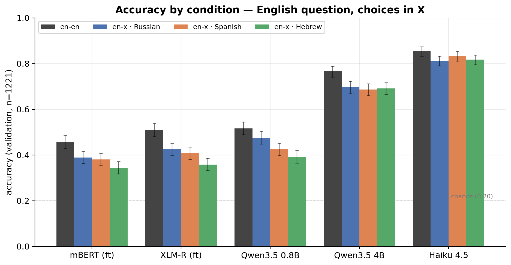

| model | en-en | en-x ru | en-x es | en-x he |
|---|---|---|---|---|
| Haiku 4.5 | 0.854 | 0.812 | 0.833 | 0.817 |
| Qwen3.5 4B | 0.766 | 0.697 | 0.686 | 0.691 |
| Qwen3.5 0.8B | 0.517 | 0.476 | 0.424 | 0.392 |
| XLM-R (ft) | 0.510 | 0.424 | 0.408 | 0.358 |
| mBERT (ft) | 0.457 | 0.389 | 0.380 | 0.344 |

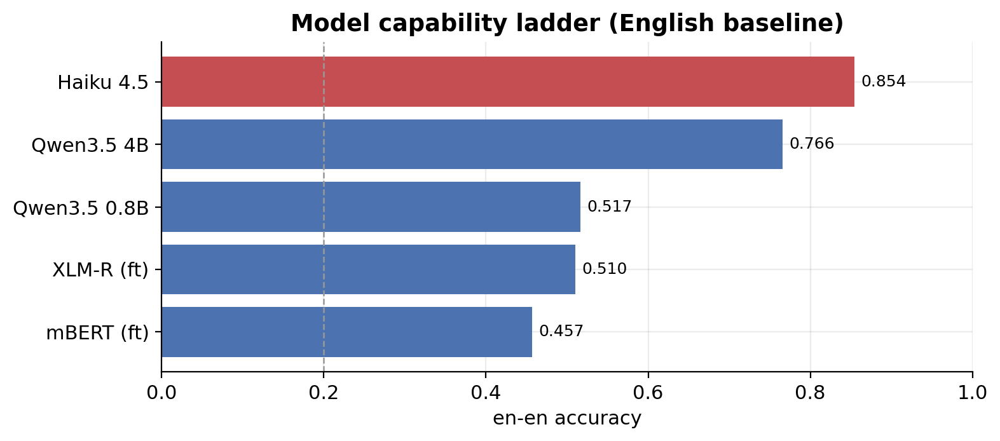

Haiku 4.5 leads at **0.854** en-en — far above the fine-tuned encoders
(XLM-R 0.510); a frontier LLM zero-shot is in a different regime from a
fine-tuned base encoder, a useful upper anchor.

## 2. The core diagnostic — prediction flips (en-en → en-x)

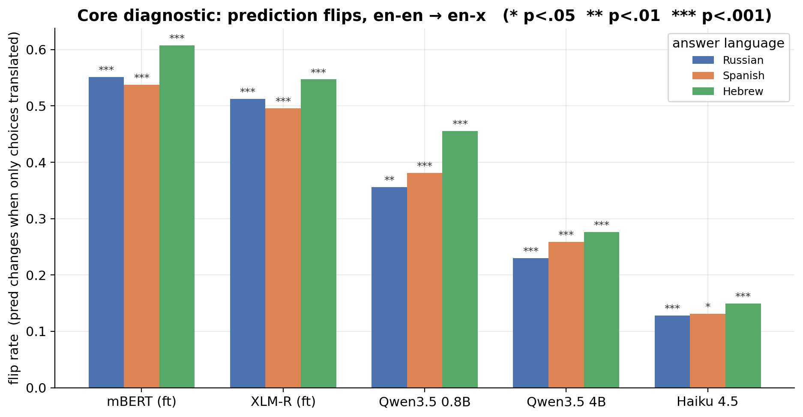

Flip rate (`*` p<.05 `**` p<.01 `***` p<.001, McNemar):

| model | ru | es | he |
|---|---|---|---|
| mBERT (ft) | 0.551*** | 0.537*** | 0.608*** |
| XLM-R (ft) | 0.513*** | 0.495*** | 0.547*** |
| Qwen3.5 0.8B | 0.356** | 0.381*** | 0.455*** |
| Qwen3.5 4B | 0.230*** | 0.259*** | 0.276*** |
| Haiku 4.5 | 0.128*** | 0.131* | 0.149*** |

The same view restricted to the harmful direction — **away-from-gold rate** (items the
model got right in English but wrong once only the choices were translated):

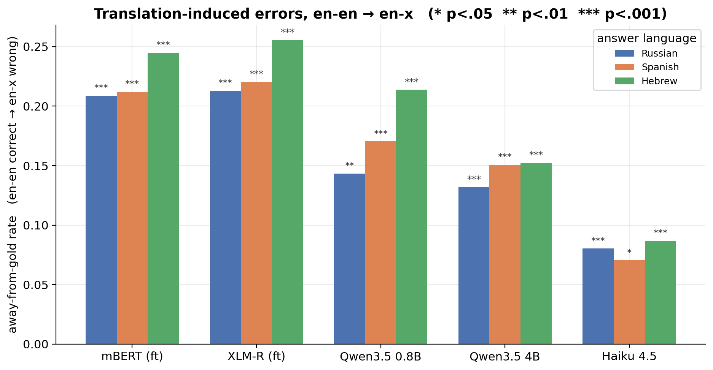

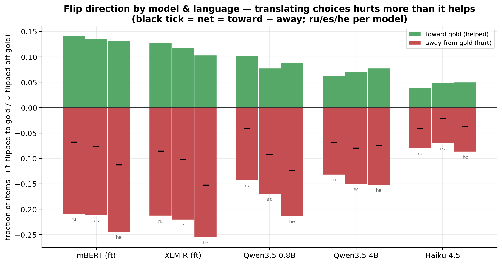

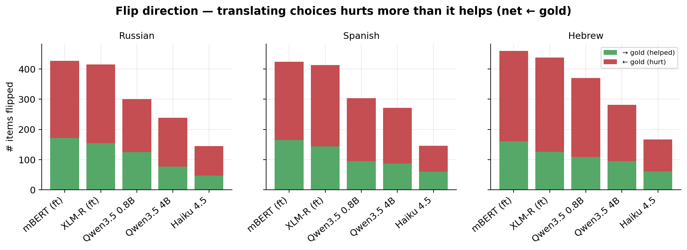

Flips are **net away from gold** — translating the choices hurts more than it helps,
which is what drives the accuracy drop.

**Significance (McNemar, paired on the same items).** The en-en→en-x accuracy change
is tested with McNemar's test on the discordant pairs: **b** = items en-en got right
but en-x got wrong, **c** = en-en wrong but en-x right; continuity-corrected
χ² = (|b−c|−1)²/(b+c), df=1. Every condition is significant (`*` p<.05 `**` p<.01
`***` p<.001), with **b ≫ c** throughout — far more predictions break than get fixed:

| model | lang | b: en✓→x✗ | c: en✗→x✓ | χ²_cc | p | sig |
|---|---|---|---|---|---|---|
| mBERT (ft) | ru | 255 | 172 | 15.7 | 7.2e-05 | *** |
| mBERT (ft) | es | 259 | 165 | 20.4 | 6.3e-06 | *** |
| mBERT (ft) | he | 299 | 161 | 40.8 | 1.7e-10 | *** |
| XLM-R (ft) | ru | 260 | 155 | 26.1 | 3.3e-07 | *** |
| XLM-R (ft) | es | 269 | 144 | 37.2 | 1.0e-09 | *** |
| XLM-R (ft) | he | 312 | 126 | 78.1 | 9.6e-19 | *** |
| Qwen3.5 0.8B | ru | 175 | 125 | 8.0 | 4.7e-03 | ** |
| Qwen3.5 0.8B | es | 208 | 95 | 41.4 | 1.2e-10 | *** |
| Qwen3.5 0.8B | he | 261 | 109 | 61.6 | 4.2e-15 | *** |
| Qwen3.5 4B | ru | 161 | 77 | 28.9 | 7.4e-08 | *** |
| Qwen3.5 4B | es | 184 | 87 | 34.0 | 5.5e-09 | *** |
| Qwen3.5 4B | he | 186 | 95 | 28.8 | 7.9e-08 | *** |
| Haiku 4.5 | ru | 98 | 47 | 17.2 | 3.3e-05 | *** |
| Haiku 4.5 | es | 86 | 60 | 4.3 | 3.9e-02 | * |
| Haiku 4.5 | he | 106 | 61 | 11.6 | 6.6e-04 | *** |

## 3. Strength story — concept-grounding scales with capability

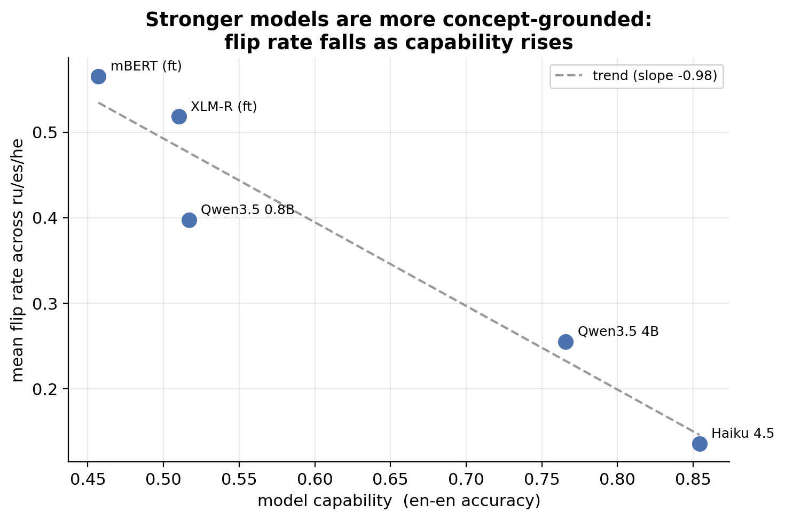

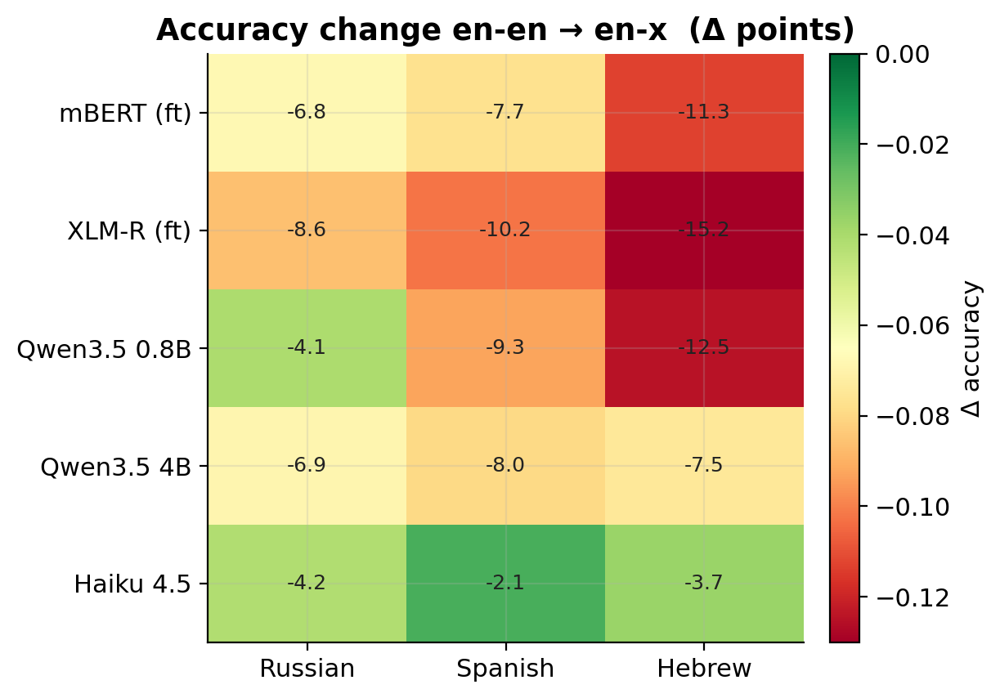

The clearest single result: **the more capable the model, the smaller the flip rate.**
Concept-grounding is not all-or-nothing — it emerges with model strength.

## 4. The translations themselves

The main experiment uses **Google Cloud Translation** for the answer choices
(question stays English). Descriptive stats on that set (n=1221 questions, 6105
choices/lang):

| answer language | avg choice length | within-question collisions | choices unchanged from English | 3-MT unanimous |
|---|---|---|---|---|
| Russian | 10.7 chars | 76 q (6.2%) | 6 (0.1%) | 39% |
| Spanish | 10.9 chars | 64 q (5.2%) | 256 (4.2%) | 48% |
| Hebrew | 7.4 chars | 59 q (4.8%) | 53 (0.9%) | 35% |

- **Within-question collisions** (~5–6%): two different English choices translate to
  the *same* target string, making those items genuinely ambiguous — a built-in noise
  floor that caps achievable accuracy and explains some flips.
- **Unchanged from English**: Spanish keeps **4.2%** of choices in English form
  (cognates / proper nouns) vs ~1% for Russian/Hebrew — Spanish sits "closest" to the
  English surface.
- **Hebrew is hardest to translate**: shortest choices, lowest cross-MT agreement, and
  Opus-MT additionally emits Latin-script hallucinations on **4.3%** of Hebrew cells.

Clean (3-MT consensus) vs broken Hebrew translations — Google (the main set) is largely
clean; the worst breakage is Opus on Hebrew (`scripts/hebrew_gallery.py`):

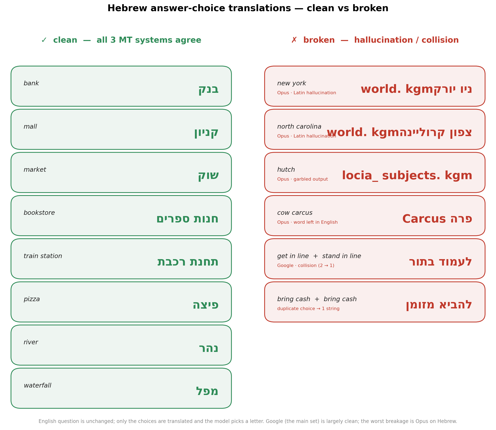

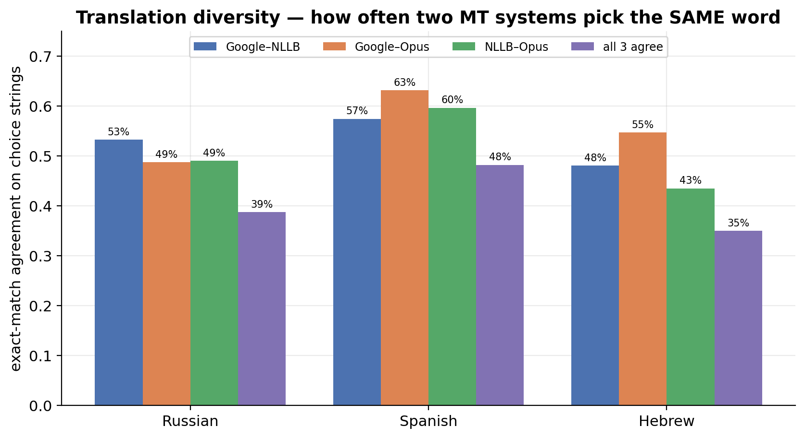

Three independent MT systems (Google / NLLB / Opus) agree on the exact word only
**35–48%** of the time — the translations are genuinely diverse. Yet model accuracy
is stable across them, and across a **majority-vote consensus** set (Google +
NLLB-3.3B + Opus; ≥2 of 3 agree, else Google breaks the tie; ties broken on 17–25%
of choices — fewer than with the weaker 600M, which agreed less):

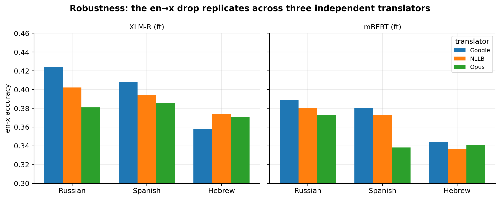

The degradation ordering is **translator-invariant**: Google, NLLB, Opus and the
consensus set all produce the same pattern for the encoders, so the effect is not an
artifact of one translation backend — it separates concept-grounding from MT noise.

**Stronger translation doesn't help.** Scaling the open translator **5.5×** (NLLB
distilled-600M → full **3.3B**) leaves the drop essentially unchanged (xlmr-ep6
en-x: ru 0.402→0.416, es 0.394→0.396, he 0.374→0.363; all still ~10 pts below the
0.510 English baseline). If the degradation were driven by translation *quality*, a
much stronger MT model would close the gap — it doesn't. This is direct evidence the
effect is **cross-lingual concept grounding, not MT error**.

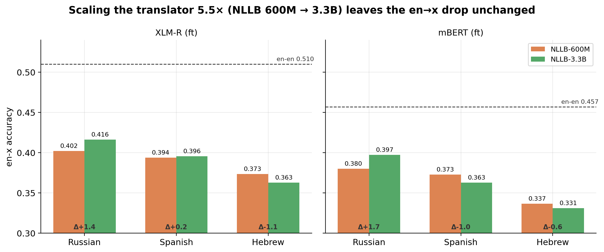

The same accuracy-by-condition view (Fig 1's layout) per translator — en-en is
translator-independent, and the non-Google panels are encoder-only (only XLM-R/mBERT
were run on NLLB/Opus/Consensus):

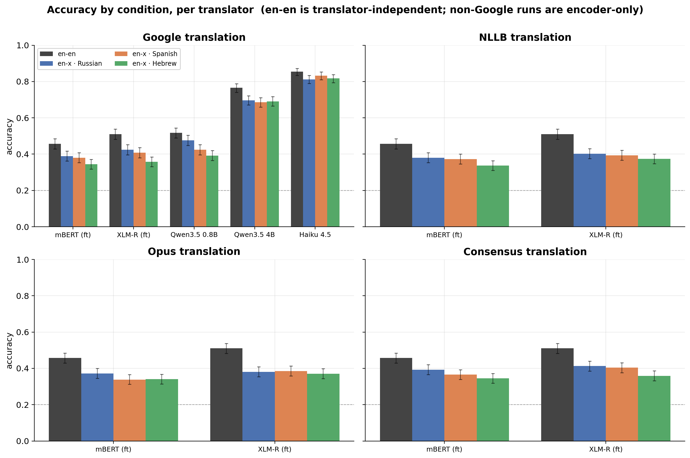

### Recoverable headroom — picking the answer across translations

What if we combine the model's predictions under the three translations per item?

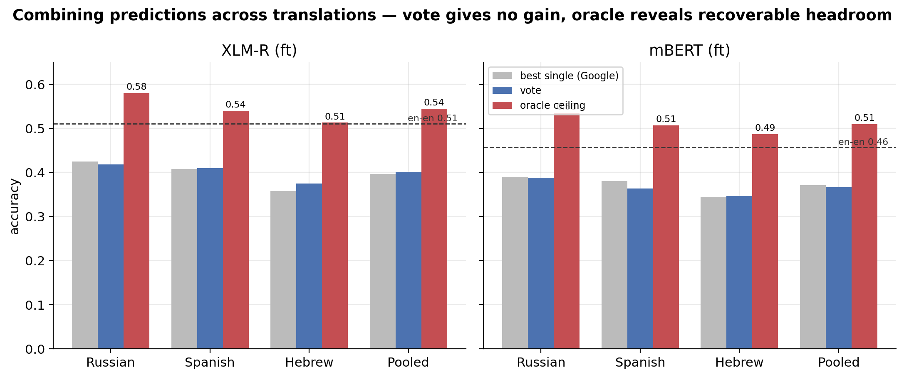

- **Majority vote ≈ best single source** (xlmr-ep6 0.400 vs 0.397) — naive ensembling
  buys nothing; the translations aren't independent enough to vote-correct.
- **Oracle ceiling +14.7 pts** (0.544, *above* the en-en 0.510 baseline): if you could
  pick the right translation per item, most of the en→x drop disappears. So a large
  share of the degradation is **translation-phrasing-dependent, not concept failure** —
  the model often knows the answer under *some* phrasing.
- The oracle is an **upper bound** (three tries at a 5-way choice exploits chance), so
  read the **vote→oracle gap** as recoverable headroom that no simple combiner captures.
  (`results/translation_ensemble.csv`, `scripts/translation_ensemble.py`.)

## 5. Training dynamics (encoders)

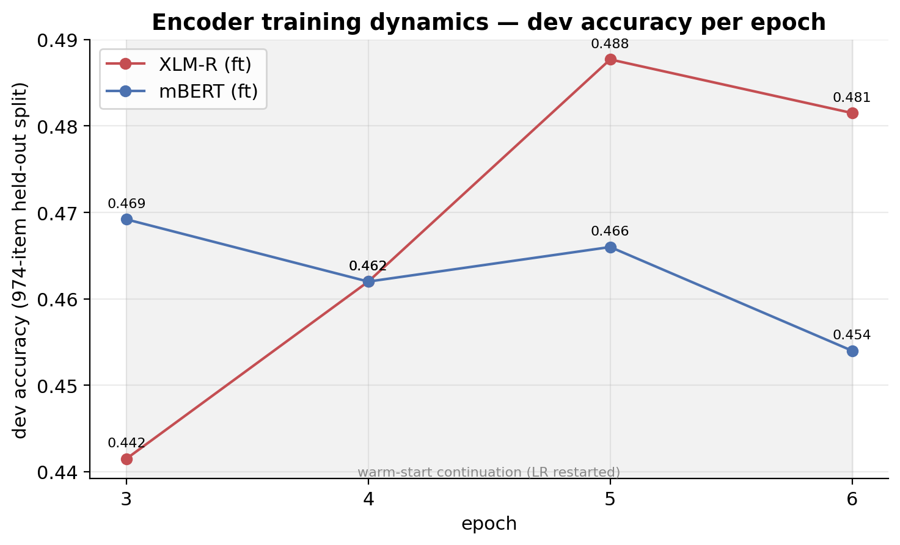

Per-epoch **dev accuracy** (974-item held-out split). *Per-step train loss was not
persisted during the original runs* (`report_to=[]`), so this is the recorded
learning signal. XLM-R keeps improving to ~5 epochs (kept checkpoint); mBERT plateaus
by epoch 2–3 and the warm-start continuation mildly overtrains — consistent with
XLM-R's stronger cross-lingual transfer.

## 6. Worked examples — English-anchoring caught in the act

Items Haiku got **right** in English but **wrong** once the choices were shown in
Hebrew (same question, only choice language changed):

1. **Q:** What do people aim to do at work?
   - gold **A** = `complete job`  (→ in Hebrew: `עבודה שלמה`)
   - en-en predicted **A** ✓ correct
   - en-x (Hebrew) predicted **B** = `ללמוד אחד מהשני` ✗ — flipped off gold
2. **Q:** He needed more information to fix it, so he consulted the what?
   - gold **E** = `manual`  (→ in Hebrew: `ידני`)
   - en-en predicted **E** ✓ correct
   - en-x (Hebrew) predicted **B** = `גוגל` ✗ — flipped off gold
3. **Q:** Where would you go if you wanted to have fun with a few people?
   - gold **D** = `friend's house`  (→ in Hebrew: `בית של חבר`)
   - en-en predicted **D** ✓ correct
   - en-x (Hebrew) predicted **C** = `קולנוע` ✗ — flipped off gold

---

## Reproduce

```bash
python -m scripts.analyze            # refresh results/summary.csv + flips.csv
python -m report.build_report        # regenerate every figure + this README
```

## Provenance & caveats

- **Encoders / Qwens / Gemini** arms are deterministic (`temperature=0`, seeded,
  manifested). The **Haiku** arm is **non-deterministic** (subscription subagents,
  temperature not pinned) — an exploratory LLM upper-anchor, flagged in its manifest.
- Source CSVs: `results/summary.csv`, `results/flips.csv`,
  `results/translation_agreement.csv`. Frozen per-arm archives live under
  `results/archive/`.
